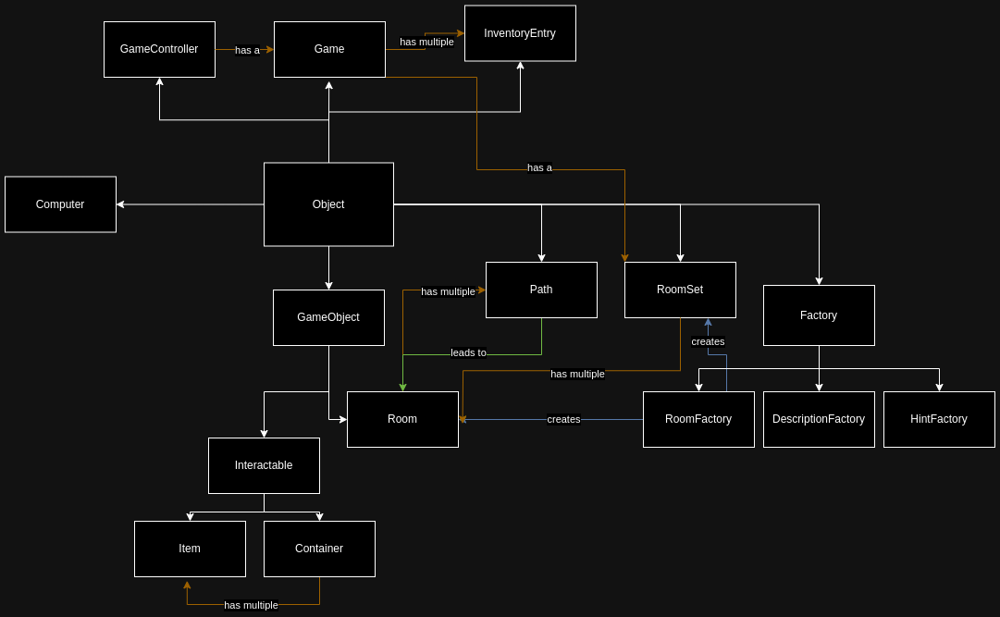

# Smalltalk Project
Text-based puzzle adventure game, written in GNU Smalltalk programming language.
Assignment for Programing Paradigms course @ Warsaw University of Technology.

[Example gameplay](./docs/playthrough.txt)

## Authors
* Mikołaj Garbowski
* Maksym Bieńkowski

## Installation
Requires `gst` GNU Smalltalk virtual machine to run.

```shell
sudo apt install gnu-smalltalk
```

## Run the game
```shell
./run
```

## Class diagram
